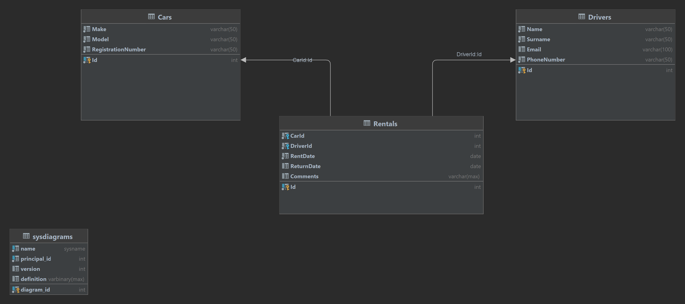

# Rental Application

This is a WPF MVVM application, which allows to rent a car from database.

## Database diagram

## Features

- Show information about car rentals
- Registration of new car rental
- Data update during registration of car return
- Deleting information about rentals
- Export data to CSV File
- Loggs every user's actions
